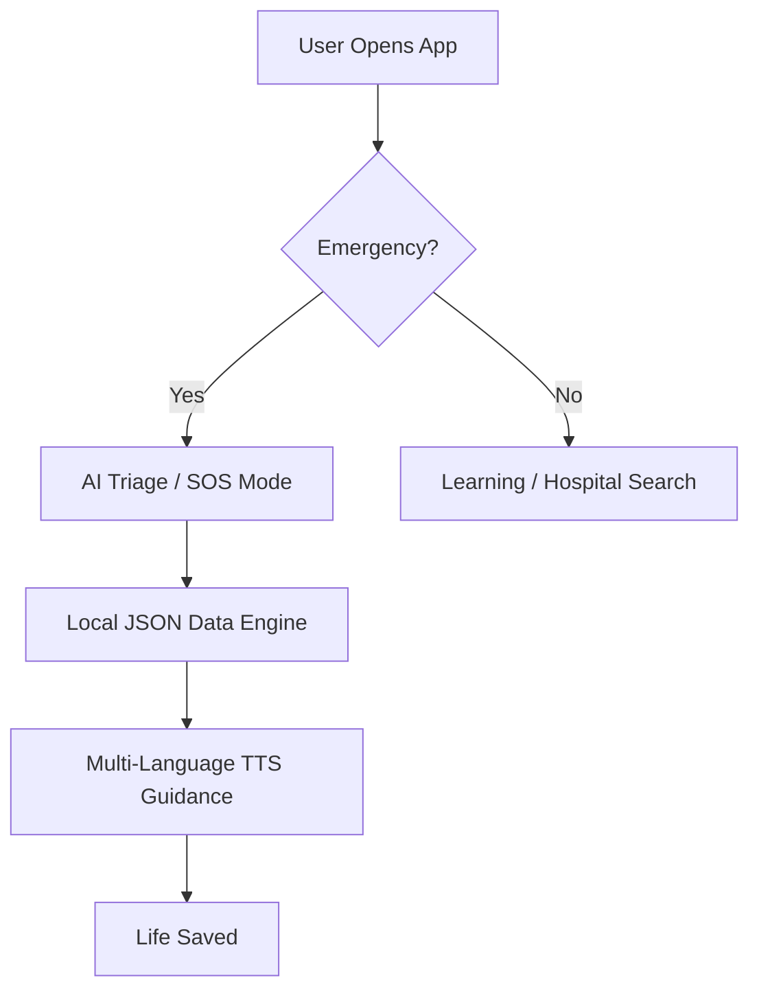

<div align="center">
  
  <h1>Pratham Chikitse (First Aid)</h1>
  <p><strong>The Pocket-Sized Life Saver: An Offline-First Emergency Triage Platform</strong></p>
  <p><strong>Developed by @dayanandask</strong></p>

  [](https://kotlinlang.org)
  [](https://developer.android.com)
  [](https://developer.android.com/jetpack/compose)
  []()
  []()
  [](LICENSE)
</div>

---

## 🌟 Why Pratham Chikitse?
In critical emergencies, every second counts. However, reliable internet is not always a guarantee—especially in remote areas or during natural disasters. **Pratham Chikitse** bridges this gap by providing high-quality medical guidance that works **100% offline**. 

It’s not just a manual; it’s an intelligent assistant that speaks your language and guides you through the chaos of an emergency.

## ✨ Key Features

- **🤖 AI-Powered Triage Chatbot**: A locally running NLP engine that interprets symptoms and suggests immediate first-aid protocols.
- **🗣️ Voice-First & TTS**: Fully accessible via Text-to-Speech, reading instructions aloud in regional languages so you can keep your hands free.
- **🌍 Vernacular Support**: Seamlessly switch between **English, Kannada, Hindi, Gujarati, Marathi, and Tamil**.
- **📍 Offline Hospital Locator**: Find the nearest medical facility using pre-indexed offline geo-data.
- **🚨 Instant SOS**: A one-tap floating button to trigger emergency calls and notify custom contacts.
- **📚 Learning Hub**: Dedicated modules for "Myths vs. Facts" and preventative health education.

## 🏗️ How it Works (Logic Flow)



## 🛠️ Technology Stack

| Layer | Technology |
| :--- | :--- |
| **Language** | Kotlin 2.0.0 (Strongly Typed, Coroutines) |
| **UI** | Jetpack Compose (Material 3) |
| **Architecture** | Clean Architecture + MVVM |
| **DI** | Dagger Hilt |
| **Storage** | Preferences DataStore & Optimized JSON Assets |
| **Navigation** | Jetpack Compose Navigation |

## 🚀 Getting Started

### Prerequisites
- Android Studio **Koala** or newer.
- **JDK 17** (Mandatory for Kotlin 2.0).
- Android SDK **API 34**.

### Installation
1. **Clone the repo**
   ```bash
   git clone https://github.com/dayanandask/Pratham-Chikitse-Android.git
   ```
2. **Open in Android Studio**
   Let the Gradle sync finish. No API keys are required as the app is entirely offline-driven.
3. **Run**
   Hit `Run` (Shift+F10) on your emulator or physical device.

## 📂 Project Architecture
The project follows a strict **Clean Architecture** pattern to ensure the codebase remains maintainable and testable.

```text
com.example.health/
├── data/           # Repository implementations & Local DataSources
├── domain/         # Business logic (Models & UseCases)
├── ui/             # ViewModels, Compose Screens, and State management
│   ├── assistant/  # Triage Chatbot Logic
│   ├── emergency/  # First Aid Guidance UI
│   └── hospital/   # Offline Maps/Directory
└── util/           # TTS & Localization Helpers
```

## 🗺️ Roadmap & Future Enhancements
- [ ] **Bluetooth Mesh Networking**: Share location data with nearby responders without cell service.
- [ ] **AR First Aid**: Use Augmented Reality to overlay bandage or CPR techniques via the camera.
- [ ] **Vitals Scanning**: Integrate camera-based heart rate and oxygen level estimation.

---
<div align="center">
  Developed by <b>dayanandask</b> as part of the Internship Project.<br>
  Built with ❤️ for a safer world.
</div>
